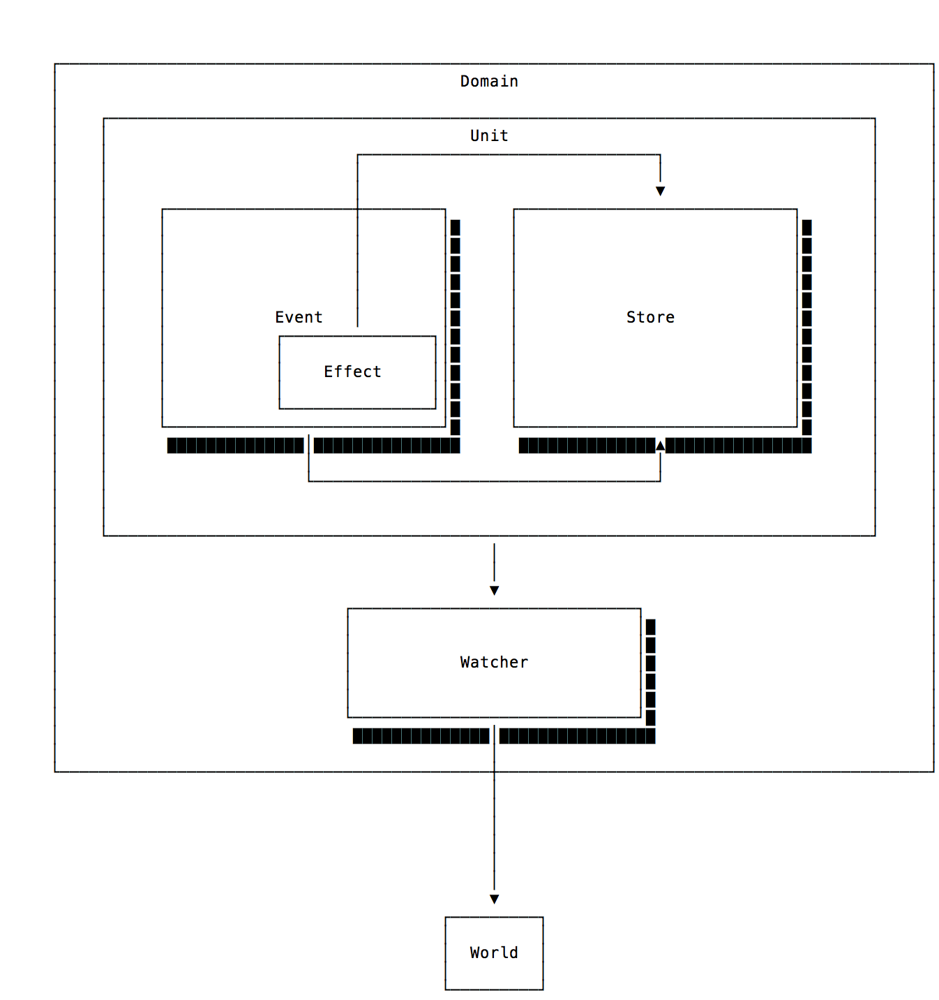

# ☄️ Effector

> Reactive state manager

[](https://badge.fury.io/js/effector) [ ](https://app.codeship.com/projects/288022) [](https://semaphoreci.com/zerobias/effector)
[](https://gitter.im/effector-js/community?utm_source=badge&utm_medium=badge&utm_campaign=pr-badge&utm_content=badge)


<a href="https://www.patreon.com/zero_bias/overview"></a>

## Table of Contents

<!-- START doctoc generated TOC please keep comment here to allow auto update -->
<!-- DON'T EDIT THIS SECTION, INSTEAD RE-RUN doctoc TO UPDATE -->

- [Introduction](#introduction)
  - [Effector follows five basic principles:](#effector-follows-five-basic-principles)
- [Installation](#installation)
  - [Additional packages:](#additional-packages)
- [Examples](#examples)
  - [Increment/decrement](#incrementdecrement)
  - [Hello world with events and nodejs](#hello-world-with-events-and-nodejs)
    - [Run example](#run-example)
  - [Storages and events](#storages-and-events)
    - [Run example](#run-example-1)
- [Demo](#demo)
  - [More examples/demo you can check here](#more-examplesdemo-you-can-check-here)
- [API](#api)
  - [Event](#event)
  - [Effect](#effect)
  - [Store](#store)
  - [Domain](#domain)
- [Contributors](#contributors)
- [License](#license)

<!-- END doctoc generated TOC please keep comment here to allow auto update -->

## Introduction

Effector is an effective multi store state manager for Javascript apps **(React/Vue/Node.js)**, that allows you to manage data in complex applications without the risk of inflating the monolithic central store, with clear control flow, good type support and high capacity API. Effector supports both **TypeScript** and **Flow** type annotations out of the box.

> Detailed comparison with other state managers will be added soon

### Effector follows five basic principles:

- **Application stores should be as light as possible** - the idea of adding a store for specific needs should not be frightening or damaging to the developer.
- **Application stores should be freely combined** - data that the application needs can be statically distributed, showing how it will be converted in runtime.
- **Autonomy from controversial concepts** - no decorators, no need to use classes or proxies - this is not required to control the state of the application and therefore the api library uses only functions and simple js objects
- **Predictability and clarity of API** - A small number of basic principles are reused in different cases, reducing the user's workload and increasing recognition. For example, if you know how .watch works for events, you already know how .watch works for stores.
- **The application is built from simple elements** - space and way to take any required business logic out of the view, maximizing the simplicity of the components.



## Installation

```bash
npm install --save effector
```

Or using `yarn`

```bash
yarn add effector
```

### Additional packages:

- **For Web Framework/Libraries:**

  |                                           Package                                            |                                                       Version                                                       |                                                                             Dependencies                                                                             |
  | :------------------------------------------------------------------------------------------: | :-----------------------------------------------------------------------------------------------------------------: | :------------------------------------------------------------------------------------------------------------------------------------------------------------------: |
  | [`effector-react`](https://github.com/zerobias/effector/tree/master/packages/effector-react) | [](https://www.npmjs.com/package/effector-react) | [](https://david-dm.org/zerobias/effector?path=packages/effector-react) |
  |   [`effector-vue`](https://github.com/zerobias/effector/tree/master/packages/effector-vue)   |   [](https://www.npmjs.com/package/effector-vue)   |   [](https://david-dm.org/zerobias/effector?path=packages/effector-vue)   |

- **For another languages:**

  |                                              Package                                               |                                                          Version                                                          |                                                                                Dependencies                                                                                |
  | :------------------------------------------------------------------------------------------------: | :-----------------------------------------------------------------------------------------------------------------------: | :------------------------------------------------------------------------------------------------------------------------------------------------------------------------: |
  |       [`bs-effector`](https://github.com/zerobias/effector/tree/master/packages/bs-effector)       |       [](https://www.npmjs.com/package/bs-effector)       |       [](https://david-dm.org/zerobias/effector?path=packages/bs-effector)       |
  | [`bs-effector-react`](https://github.com/zerobias/effector/tree/master/packages/bs-effector-react) | [](https://www.npmjs.com/package/bs-effector-react) | [](https://david-dm.org/zerobias/effector?path=packages/bs-effector-react) |

## Examples

Three following examples that will give you a basic understanding how the state manager works:

### Increment/decrement

```js
import {createStore, createEvent} from 'effector'
import {useStore} from 'effector-react'

const increment = createEvent('increment')
const decrement = createEvent('decrement')
const resetCounter = createEvent('reset counter')

const counter = createStore(0)
  .on(increment, state => state + 1)
  .on(decrement, state => state - 1)
  .reset(resetCounter)

counter.watch(console.log)

const Counter = () => {
  const value = useStore(counter)

  return (
    <>
      <div>{value}</div>
      <button onClick={increment}>+</button>
      <button onClick={decrement}>-</button>
      <button onClick={resetCounter}>reset</button>
    </>
  )
}

const App = () => <Counter />
```

<hr />

### Hello world with events and nodejs

```js
const {createEvent} = require('effector')

const messageEvent = createEvent('message event (optional description)')

messageEvent.watch(text => console.log(`new message: ${text}`))

messageEvent('hello world')
// => new message: hello world
```

#### [Run example](https://runkit.com/zerobias/effector-hello-world)

<hr />

### Storages and events

```js
const {createStore, createEvent} = require('effector')

const turnOn = createEvent()
const turnOff = createEvent()

const status = createStore('offline')
  .on(turnOn, () => 'online')
  .on(turnOff, () => 'offline')

status.watch(newStatus => {
  console.log(`status changed: ${newStatus}`)
})
// for store watchs callback invokes immediately
// "status changed: offline"

turnOff() // nothing has changed, callback is not triggered
turnOn() // "status changed: online"
turnOff() // "status changed: offline"
turnOff() // nothing has changed
```

#### [Run example](https://runkit.com/zerobias/effector-storages-and-events)

<hr />

## Demo

> [](https://codesandbox.io/s/vmx6wxww43) Basic example

> [](https://codesandbox.io/s/1y6n4r6o57) SSR example

### More examples/demo you can check [here](https://github.com/zerobias/effector/tree/master/examples)

## API

### Event

Event is an intention to change state.

```js
const event = createEvent() // unnamed event
const onMessage = createEvent('message') // named event

const socket = new WebSocket('wss://echo.websocket.org')
socket.onmessage = msg => onMessage(msg)

const data = onMessage.map(msg => msg.data).map(JSON.parse)

// Handle side effects
data.watch(console.log)
```

### Effect

**Effect** is a container for async function.
It can be safely used in place of the original async function.
The only requirement for function - **Should have zero or one argument**

```js
const getUser = createEffect('get user').use(params => {
  return fetch(`https://example.com/get-user/${params.id}`).then(res =>
    res.json(),
  )
})

// subscribe to promise resolve
getUser.done.watch(({result, params}) => {
  console.log(params) // {id: 1}
  console.log(result) // resolved value
})

// subscribe to promise reject (or throw)
getUser.fail.watch(({error, params}) => {
  console.error(params) // {id: 1}
  console.error(error) // rejected value
})

// you can replace function anytime
getUser.use(() => promiseMock)

// call effect with your params
getUser({id: 1})

const data = await getUser({id: 2}) // handle promise
```

### Store

**Store** is an object that holds the state tree. There can be multiple stores.

```js
// `getUsers` - is an effect
// `addUser` - is an event
const defaultState = [{ name: Joe }];
const users = createStore(defaultState)
  // subscribe store reducers to events
  .on(getUsers.done, (oldState, payload) => payload)
  .on(addUser, (oldState, payload) => [...oldState, payload]))

// subscribe side-effects
const callback = (newState) => console.log(newState)
users.watch(callback) // `.watch` for a store is triggered immediately: `[{ name: Joe }]`
// `callback` will be triggered each time when `.on` handler returns the new state
```

Most profit thing of stores is their compositions:

```js
// `.map` accept state of parent store and return new memoized store. No more reselect ;)
const firstUser = users.map(list => list[0])
firstUser.watch(newState => console.log(`first user name: ${newState.name}`)) // "first user name: Joe"

addUser({name: Joseph}) // `firstUser` is not updated
getUsers() // after promise resolve `firstUser` is updated and call all watchers (subscribers)
```

### Domain

**Domain** is a namespace for your events, stores and effects.
Domain can subscribe to event, effect, store or nested domain creation with **onCreateEvent**, **onCreateStore**, **onCreateEffect**, **onCreateDomain(to handle nested domains)** methods.

```js
import {createDomain} from 'effector'
const mainPage = createDomain('main page')
mainPage.onCreateEvent(event => {
  console.log('new event: ', event.getType())
})
mainPage.onCreateStore(store => {
  console.log('new store: ', store.getState())
})
const mount = mainPage.event('mount')
// => new event: main page/mount

const pageStore = mainPage.store(0)
// => new store: 0
```

> [Learn more](https://effector.now.sh/en/introduction/core-concepts)

## Contributors

<!-- ALL-CONTRIBUTORS-LIST:START - Do not remove or modify this section -->
<!-- prettier-ignore -->
| [<br /><sub><b>Dmitry</b></sub>](https://zerobias.net)<br />[💬](#question-zerobias "Answering Questions") [💻](https://github.com/zerobias/effector/commits?author=zerobias "Code") [📖](https://github.com/zerobias/effector/commits?author=zerobias "Documentation") [💡](#example-zerobias "Examples") [🤔](#ideas-zerobias "Ideas, Planning, & Feedback") [🚇](#infra-zerobias "Infrastructure (Hosting, Build-Tools, etc)") [⚠️](https://github.com/zerobias/effector/commits?author=zerobias "Tests") | [<br /><sub><b>andretshurotshka</b></sub>](https://github.com/goodmind)<br />[💬](#question-goodmind "Answering Questions") [💻](https://github.com/zerobias/effector/commits?author=goodmind "Code") [📖](https://github.com/zerobias/effector/commits?author=goodmind "Documentation") [📦](#platform-goodmind "Packaging/porting to new platform") [⚠️](https://github.com/zerobias/effector/commits?author=goodmind "Tests") | [<br /><sub><b>Sergey Sova</b></sub>](https://sergeysova.com)<br />[📖](https://github.com/zerobias/effector/commits?author=sergeysova "Documentation") [💡](#example-sergeysova "Examples") | [<br /><sub><b>Arutyunyan Artyom</b></sub>](https://t.me/artalar)<br />[📖](https://github.com/zerobias/effector/commits?author=artalar "Documentation") [💡](#example-artalar "Examples") | [<br /><sub><b>Ilya</b></sub>](https://github.com/Komar0ff)<br />[📖](https://github.com/zerobias/effector/commits?author=Komar0ff "Documentation") |
| :-------------------------------------------------------------------------------------------------------------------------------------------------------------------------------------------------------------------------------------------------------------------------------------------------------------------------------------------------------------------------------------------------------------------------------------------------------------------------------------------------------------------------------------------------------------------------------------------: | :--------------------------------------------------------------------------------------------------------------------------------------------------------------------------------------------------------------------------------------------------------------------------------------------------------------------------------------------------------------------------------------------------------------------------------------------------------------------------------------------------------------: | :--------------------------------------------------------------------------------------------------------------------------------------------------------------------------------------------------------------------------------------------------------------------------: | :-------------------------------------------------------------------------------------------------------------------------------------------------------------------------------------------------------------------------------------------------------------------------: | :----------------------------------------------------------------------------------------------------------------------------------------------------------------------------------------------------------------------------------: |

<!-- ALL-CONTRIBUTORS-LIST:END -->

## License

[MIT](LICENSE)
